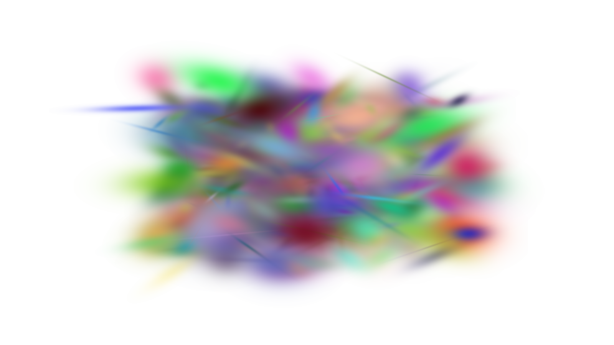

# Rendering

The primary function of this library is `jaxsplat.render`:

```{eval-rst}
.. autofunction:: jaxsplat.render
```

## Basic usage

Let's render random 3D Gaussians to an image.
We start by importing packages:

```python
import jaxsplat
import jax.numpy as jnp
import jax
import imageio.v3 as iio
```

`jaxsplat.render` takes 5 array inputs describing the geometry and appearance of 3D Gaussians.
Instead of means, 3D covariances, colors, and opacities, we use means, scales, quaternions, colors, and opacities.
Let's initialize them randomly with 1000 Gaussians:

```python
key = jax.random.key(0)
key, *subkeys = jax.random.split(key, 6)

num_points = 1000

means3d = jax.random.uniform(subkeys[0], (num_points, 3), minval=-3, maxval=3)
scales = jax.random.uniform(subkeys[1], (num_points, 3), maxval=0.5)
quats = jax.random.normal(subkeys[2], (num_points, 4))
colors = jax.random.uniform(subkeys[3], (num_points, 3))
opacities = jax.random.uniform(subkeys[4], (num_points, 1))
```

Our quaternions need to be normalized before using them with `jaxsplat.render`:

```python
quats /= jnp.linalg.norm(quats, axis=-1, keepdims=True)
```

We then set the other parameters. Let's output a `(900, 1600)` image, use 90 degrees FoV, and set the principal point to the center of the viewport.
We also set the global scale of Gaussians to 1 and clip any Gaussians closer than 0.01 to the camera:

```python
viewmat = jnp.array([
  [1, 0, 0, 0],
  [0, 1, 0, 0],
  [0, 0, 1, 8],
  [0, 0, 0, 1],
], dtype=jnp.float32)
background = jnp.ones((3,), dtype=jnp.float32)
W = 1600
H = 900
img_shape = H, W
f = (W / 2, H / 2)
c = (W / 2, H / 2)
glob_scale = 1
clip_thresh = 0.01
```

We're now ready to render and save the image to a file:

```python
img = jaxsplat.render(
    means3d,
    scales,
    quats,
    colors,
    opacities,
    viewmat=viewmat,
    background=background,
    img_shape=img_shape,
    f=f,
    c=c,
    glob_scale=glob_scale,
    clip_thresh=clip_thresh,
)
iio.imwrite("output.png", (img * 255).astype(jnp.uint8))
```

We got our output!


